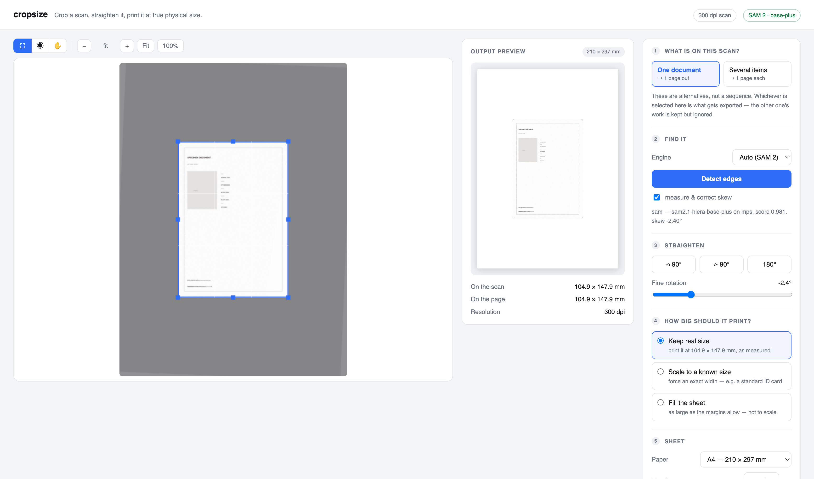
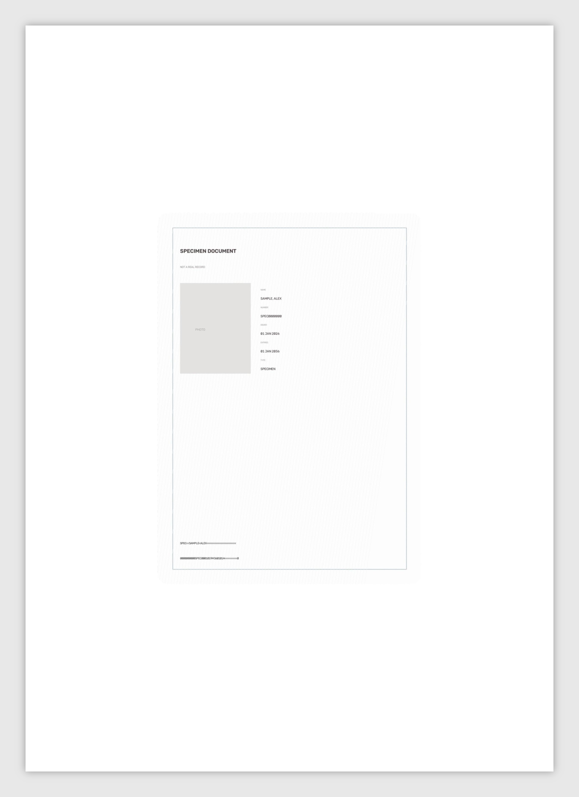

# cropsize

Crop a scan, straighten it, and print it at its real physical size.

Live: **[cropsize.pages.dev](https://cropsize.pages.dev)** runs in your browser, no install,
no upload. The default base-plus model downloads once, about 163 MB, and is cached after
that. A 78 MB tiny model is available from the toolbar.



## What it is for

You scanned a passport, an ID card, a certificate. Now you need it on A4, cropped clean,
straight, and at exactly the size the real thing is, because the office you are sending it
to will reject it otherwise.

Every scanning app crops. Almost none of them get the size right. cropsize reads the real
size off the scan itself and prints at 1 to 1, so a passport page comes out 125 by 88
millimetres on paper, not roughly that big.

## How it works

Drop in a PDF or an image. It finds the document, tells you how big it actually is, and puts
it on the sheet you choose.

Three things make it more than a crop tool.

**It knows how big things are.** A scanner writes the scanned area into a PDF at 1 to 1, so
the real size falls straight out of the pixel count. On the sample scan it reads 104.9 by
147.9 millimetres for a document that is genuinely 105 by 148. No preset, no guessing, no
asking you what the object is.

**It finds paper on paper.** A passport in a clear sleeve, a receipt on a white desk. There
is no brightness step to threshold, so ordinary edge detection grabs the printing instead of
the paper. cropsize uses Segment Anything 2, which finds objects by what they are rather
than by how much they stand out.

**It keeps your rounded corners.** A crop has to be a rectangle, so the corners of any real
document pick up whatever sits outside the curve. cropsize traces the actual outline and
clears those corners to white.



## Two ways to run it

**In the browser.** Open [cropsize.pages.dev](https://cropsize.pages.dev) and click
**Try the sample**. SAM 2.1 base plus runs in the tab itself on WASM by default, and your scan
is read by the page rather than sent anywhere, because there is no server to send it to. The
scan and the finished page sit side by side in one split view so you can compare them, with
the sizes and the sheet controls in a single strip underneath. WebGPU is behind `?gpu=1`
until it has been verified on real hardware.

**Locally, in 30 seconds**

```bash
git clone https://github.com/okturan/cropsize.git
cd cropsize
./run.sh
```

Open <http://localhost:8077> and click **Try the sample**. That is the whole tour.

For real work you want the segmentation model too. One command, then restart:

```bash
./.venv/bin/pip install -r requirements-sam.txt
```

Weights arrive from Hugging Face the first time you use them, about 320 MB, and stay on disk
after that. Nothing you scan ever leaves your machine.

## Using it

The public browser finds one document on the selected page and produces one output page.
For a multi-page PDF, choose any page from the page selector; each visited page keeps its own
crop, quarter-turn rotation and straightening angle. Drag the box or one of its corners if
the automatic crop needs help. Several-items mode, candidate cycling, merge and per-item
rotation exist in the local Python editor, but they have not reached the browser build.

Then choose how big it should print. **Keep real size** uses the measurement it took off the
scan. **Scale to a known size** forces an exact width, with presets for a passport spread, a
passport page and an ID card. **Fill the sheet** is the one that is not to scale, and it says
so.

The preview on the right is the real output page, rendered by the same code that writes the
file. Change the paper and watch the document stay the same size while the sheet changes
around it.

Contrast is off by default. What you export is what you scanned. Turn it up when you want
legibility rather than fidelity.

The local Python editor also has the `C`, `S` and `H` tools plus zoom and pan. Those keyboard
controls are not present in the public browser yet.

## How accurate is it

Everything here is measured rather than estimated. The reference is a real passport spread,
which is 125 by 176 millimetres by international standard.

| Scan | cropsize reads | Off by |
| --- | --- | --- |
| Passport on white | 126.1 by 177.0 mm | 1.1 and 1.0 mm |
| Passport in a plastic sleeve | 127.2 by 175.4 mm | 2.2 and 0.6 mm |
| ID card on a flatbed | 85.6 by 53.9 mm | 0.0 and 0.1 mm |
| Sample document | 104.9 by 147.9 mm | 0.1 and 0.1 mm |

### Does the model size matter

Only on the awkward scans. Both sizes measured on the same straightened input, against a
true 125 by 176 mm spread and a 105 by 148 mm sample:

| Scan | tiny, 78 MB | base plus, 163 MB |
| --- | --- | --- |
| Sample document | 104.9 by 147.9 mm | 104.9 by 147.9 mm |
| Passport on white | 126.1 by 177.5 mm | 126.1 by 176.7 mm |
| Passport in a sleeve | 129.5 by 176.8 mm | 127.2 by 174.9 mm |

Identical on the easy one, and base plus is about 2 mm tighter where the document sits inside
a plastic sleeve, which is the case that has no contrast to work with. The 1.9 s and 0.9 s
encoder figures came from native CPU runs, not the browser. In a production Chrome baseline
on 2026-07-31, base-plus took 16.255 s for the encoder and 35.105 s from opening the cached
sample to seeing the crop; the two decoder passes took 52.7 ms and 46.9 ms. The browser lets
you switch between the models and defaults to base plus.

Resolution does not change the measurement. The same content scanned at 150, 300, 600 and
1200 dpi measures the same to within a fraction of a millimetre, because a PDF has no dpi of
its own and the page geometry is what carries the size.

Skew is measured two independent ways and they agree to a quarter of a degree.

## What it will not do

It corrects rotation, not perspective. Flatbed scans have no keystone to fix, so a photo
taken at an angle with a phone will not be squared up.

The browser handles one detected object. It does not yet offer several items, overlapping
candidates or merge. The local Python editor has those controls.

Browser tabs do not share scans. The local Python server serializes access to its one cached
predictor so concurrent requests cannot replace each other's images.

## Under the hood

```
app.py            HTTP routes
pipeline.py       loading, transforms, deskew, tone, page layout
sam_backend.py    Segment Anything 2, imported only if installed
static/           the editor, plain JavaScript and a canvas
tests/            16 tests, no model needed
web/              the browser build, deployed to cropsize.pages.dev
site/             an older static landing page, kept for reference
```

Python with FastAPI, OpenCV and PyMuPDF. The model is SAM 2.1 running on Metal, CUDA or CPU,
whichever you have, at roughly half a second per page once warm.

Order is fixed at rotate, then straighten, then tone. The editor previews that exact frame,
so a crop box means the same thing on screen as it does in the file.

## Tests

```bash
./.venv/bin/pip install pytest
./.venv/bin/pytest tests/ -q
```

They cover what would go wrong quietly rather than loudly. Real size surviving a crop. The
same measurement at every resolution. Page geometry to half a millimetre. Two presets that
share a width behaving differently, which they did not until a test caught it.

Those 16 tests exercise the Python implementation. The browser fixture suite is planned in
`openspec/changes/browser-core-and-parity/` but has not been added yet.

## Licence

Copyright © 2026 Okan Erturan. cropsize is free software under the
[GNU Affero General Public License v3](LICENSE) (`AGPL-3.0-only`). That is also the
open-source licensing path used by the Python app's PyMuPDF dependency.

The browser build does not use PyMuPDF; it reads and writes PDFs with PDF.js and pdf-lib.
The libraries and model artifacts it uses keep their own licences. Their exact versions,
sources and notices are in [Third-party notices](web/public/THIRD_PARTY_NOTICES.md).
